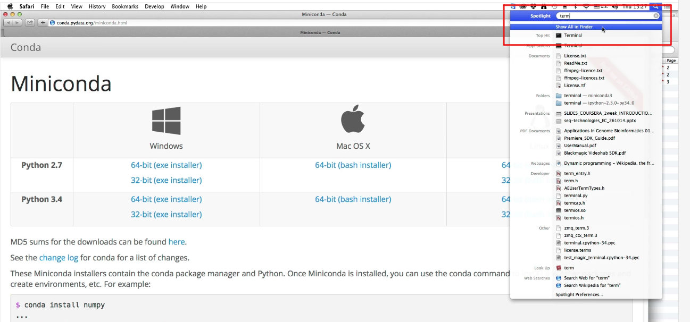
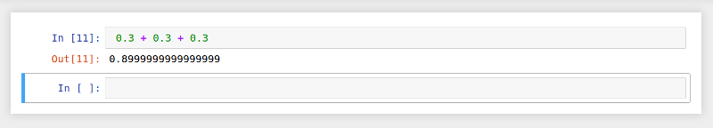

# Программирование на Python [:top:](https://github.com/pilyay/python-programming-course-by-bioinformatics-institute)

1. [

Операторы. Переменные. Типы данных. Условия
](#chapter_1)

	* :green_book: [Общая информация о курсе](#chapter_1.1)
	* :green_book: [Введение: программы и Python. Проверка заданий](#chapter_1.2)
	* :green_book: [Интерактивный режим Python. IPython](#chapter_1.3)
	* :green_book: [Установка Python на компьютер](#chapter_1.4)
	* :green_book: [Операции с целыми числами](#chapter_1.5)
	* :green_book: [Операции с вещественными числами](#chapter_1.6)
	* :green_book: [Типы данных](#chapter_1.7)
	* :green_book: [Переменные. Стандартный ввод/вывод](#chapter_1.8)
	* :green_book: [Логические операции, операции сравнения](#chapter_1.9)
	* :green_book: [Условия: if, else, elif. Блоки, отступы](#chapter_1.10)
	* :green_book: [Строки](#chapter_1.11)
	* :closed_book: [Задачи по материалам недели](#chapter_1.12)

2. [

Циклы. Строки. Списки
](#chapter_2)

	* :green_book: [Цикл while](#chapter_2.1)
	* :green_book: [Операторы break, continue](#chapter_2.2)
	* :green_book: [Цикл for](#chapter_2.3)
	* :green_book: [Строки и символы](#chapter_2.4)
	* :green_book: [Списки](#chapter_2.5)
	* :closed_book: [Задачи по материалам недели](#chapter_2.6)

3. [

Функции. Словари. Интерпретатор. Файлы. Модули
](#chapter_3)

	* :green_book: [Функции](#chapter_3.1)
	* :green_book: [Словари](#chapter_3.2)
	* :green_book: [Интерпретатор: установка, запуск скрипта](#chapter_3.3)
	* :green_book: [Файловый ввод/вывод](#chapter_3.4)
	* :green_book: [Модули, подключение модулей](#chapter_3.5)
	* :green_book: [Установка дополнительных модулей](#chapter_3.6)
	* :closed_book: [Задачи по материалам недели](#chapter_3.7)
	* :green_book: [Библиотеки для анализа данных. NumPy](#chapter_3.8)
	* :green_book: [Библиотека Matplotlib](#chapter_3.9)
	* :green_book: [Заключение](#chapter_3.10)

---

# Операторы. Переменные. Типы данных. Условия

## :page_facing_up: Общая информация о курсе [:top:](#content)

### Добро пожаловать!

Мы рады видеть вас на курсе «Программирование на Python». В этом вводном уроке мы расскажем вам о том, что вас ждёт, и дадим рекомендации по прохождению курса. Жмите кнопку «вправо», чтобы перейти к следующему шагу.

### Сначала о формате

Каждая неделя состоит из нескольких уроков, которые представляют собой наборы коротких видео-лекций (от 30 секунд до 5 минут, в редких случаях дольше).

Обычно один урок посвящен обсуждению одного понятия в общем, а один видео-фрагмент внутри урока — одной стороне или детали понятия.

Видео чередуются с простыми тестами, состоящими из одного-двух вопросов для проверки только что услышанного материала.

Внутри одного урока видеофрагменты и тесты на платформе Stepik принято называть шагами (стэпами). В верхней части окна вы можете видеть несколько иконок-квадратов. Это кнопки навигации, позволяющие перемещаться от одного фрагмента видео или тестов к другому. Также можно использовать клавиши «вправо» и «влево» на клавиатуре.

**Перейдите к следующему шагу**, чтобы увидеть тестовое задание в действии.

### Задачи
Важной частью курса является закрепление изученного материала через решение задач. И именно по результатам решения задач вам будет поставлена оценка за курс. На шагах с задачами рядом с полем ответа приводится число баллов, которое вы получите за её решение, а также набранный вами балл.

Все задачи можно решать любое количество раз. За неверные попытки баллы не снижаются, не бойтесь ошибаться! Также, все ваши прошлые решения остаются доступны по ссылке под полем задачи.

Вопрос: как называется этот курс? Чтобы ответить, нажмите на зелёное поле ниже и выберите правильный ответ.

### Wakari и Trinket
В курсе используется онлайн-платформа Wakari, позволяющая работать в интерактивном режиме Python без его установки на локальный компьютер.

В случае высокой загрузки Wakari может стать недоступным. Вместо него можно использовать аналогичный сервис [Сocalc](https://cocalc.com). Так же можно использовать [Trinket.io](https://trinket.io/python/41462f0f16). Он позволяет запускать программы на Python в вашем браузере. У него есть некоторые отличия от Wakari, о которых будет упомянуто отдельно в уроке «Интерактивный режим Python».

### Общие рекомендации по онлайн-курсу
Чтобы все функции видео-плеера (например, ускорение видео) работали корректно, используйте одну из последних версий браузера. Подробнее о поддерживаемых версиях: <http://caniuse.com/#search=mp4>

Несмотря на то, что в курсе есть видео и текстовые материалы, ведите конспект или хотя бы делайте заметки. Так материал будет лучше запоминаться.

При необходимости ставьте видео на паузу. Помните, что в онлайн-курсе материал даётся в более сжатом виде, чем на обычных лекциях. И наоборот: ускоряйте видео, если изложение кажется вам слишком медленным.

Под каждым шагом есть форум для обсуждения. В нём можно (и нужно!) задавать вопросы по материалам и задачам курса, а также помогать другим, если знаете ответ. **Пожалуйста, не выкладывайте свой код и решения задач.** Старайтесь разобраться, в чем проблема, по наводящим вопросам. Формат курса не подразумевает поиск преподавателями ошибок в индивидуальных программах студентов..

При возникновении технических вопросов по курсу пишите на почту online@bioinformaticsinstitute.ru. 

### Критерии прохождения курса по Python
Рядом с каждым тестом и задачей указано количество баллов, которое вы получите за правильное решение. Ваш общий прогресс также отображается в оглавлении курса, там же видны и сроки сдачи каждой из задач.

Суммарная стоимость всех базовых задач составляет **94** балла. Дополнительные **6** баллов можно набрать за решение задач на программирование повышенной сложности.

Для получения сертификата по курсу необходимо набрать **80** баллов, для сертификата с отличием — **90** баллов. Как только наберёте 80 баллов, в течение суток автоматически получите сертификат, а потом баллы в нём будут сами обновляться по мере решения новых задач. 

Внимание, **дедлайнов по этому курсу нет**, то есть вы можете просматривать материалы и решать задачи в удобном для вас режиме. Но если вы действительно хотите пройти этот курс, советуем вам заниматься регулярно, и проходить хотя бы по несколько уроков в день.

### Форум
Напишите ниже пару слов о себе. Почему вы решили изучать этот курс?

### Удачного прохождения курса!
Ответы на основные вопросы по платформе вы можете найти в Help Center. 

Присоединяйтесь к нам в соцсетях, чтобы узнать последние новости о платформе и курсах:

[ВКонтакте](http://vk.com/rustepik), [Facebook](http://www.facebook.com/rustepik), [Google+](http://plus.google.com/u/0/b/106625599607783514169/106625599607783514169) и [Twitter](http://twitter.com/rustepik).

Рекомендуйте курс друзьям и знакомым, ведь вместе проходить его гораздо веселее!

## :green_book: Введение: программы и Python. Проверка заданий [:top:](#content)

### Step 1 (S-12300)
Step on Stepik: <https://stepik.org/lesson/3360/step/1>

Приветствуем вас на первой неделе курса!

Мы начнем знакомство с языком Python с обзора самых базовых его возможностей, которые в то же время являются фундаментальными для разработки алгоритмов на большинстве широко используемых языков программирования: арифметические и логические операции, работа с переменными, условия, порядок выполнения.

Большое внимание будет уделено приложению IPython Notebook, с помощью которого можно работать с Python в интерактивном режиме, используя интуитивный веб-интерфейс. Благодаря этому приложению мы сразу увидим, как Python может быть использован для решения различных задач.

Часть заданий этой недели, как и большинство заданий всего курса, будет представлять из себя задачи на написание программ. Они проверяются автоматически на большом количестве случайно сгенерированных данных, поэтому мы не сможем, например, дать разъяснений, на каком именно датасете программа сработала неверно.

Для выполнения таких задач необязательно иметь установленный Python на своем компьютере, так как программы проверяются на сервере Stepic, однако это крайне желательно для дальнейшей работы.

Весь код на Python, рассматриваемый в рамках этой недели, опубликован по этой ссылке
<https://wakari.io/sharing/bundle/Pavel/week_1>
Также доступно для просмотра и скачивания объединенное видео лекций всей недели:
<http://player.vimeo.com/video/112051973>

Желаем удачи!

### Step 2 (S-12217)
Step on Stepik: <https://stepik.org/lesson/3360/step/2>

Здравствуйте. Меня зовут Павел Федотов. Я рад приветствовать вас на вводном курсе программирование на языке Python. В наше время вычисления и программирование проникли практически во все области человеческой деятельности и перестали быть уделом исключительно только суровых программистов.

Сегодня умение программировать будет полезно практически каждому. Данный курс основан на опыте обучения биологов программированию. Пройдя данный курс, вы научитесь с помощью языка Python осуществлять вычисления, необходимые вам, делать ввод вывод данных в ваших программах, писать программы, которые содержат условные конструкции и циклы, разрабатывать свои функции и использовать встроенные в Python функции и структуры данных.

Для того чтобы учиться программировать, вам необходимо будет писать программы. Просмотра одних только видеолекций будет недостаточно, также как недостаточно просмотра балета для того, чтобы научиться танцевать. Важна практика, поэтому мы предложим вам большое количество заданий. Некоторые задания будут на понимание, но большая часть заданий будет на написание программы.

Программы вы, естественно, будете писать на языке Python. Python, по-русски так же часто называют питоном, на самом деле назван в честь британской комик-группы Монти Пайтон. Язык был впервые анонсирован в 1991 году голландским программистом Гвидо ван Россумом и с тех пор развивается силами широкого сообщества программистов. Было выпущено большое количество версий этого языка. В 2008 году вышла версия Python 3, в которую был внесен ряд изменений, которые сделали этот язык несовместимым с предыдущими версиями.

Это означает, что программы, написанные на более ранних версиях языка оказалось невозможно запускать на новой версии языка - Python 3. И с тех пор существуют параллельно 2 ветки языка: Python 2 и Python 3.

Мы с вами в этом курсе будем использовать самую последнюю версию - 3 версию языка.

### Step 3 (S-12218)
Step on Stepik: <https://stepik.org/lesson/3360/step/3>

Что же это за зверь такой питон или Python? С одной стороны, Python - это интерпретатор, то есть специальная программа, которая интерпретирует или выполняет по шагам другие программы. Скачать этот интерпретатор вы можете на сайте python.org.

С другой стороны, Python, будучи языком программирования, определяет набор правил, согласно которым составляются программы. И также определяет набор правил, согласно которым эти программы исполняются на компьютере. Таким образом, программы, в том числе и те, что вы будете писать на этом курсе, представляют из себя последовательность команд для компьютера, которые написаны согласно правилам языка Python.

Более или менее все программы выглядят следующим образом. Программа читает некие пользовательские данные (чтение может происходить с клавиатуры, из файла на компьютере, или данные могут браться из интернета), дальше программа как-то манипулирует этими данными, обрабатывает их, вычисляет какие-то значения и в конце программа выводит результат пользователю. Результат может выводиться на экран, может выводится в файл или посылаться по сети. Таким образом, во многих задачах, которые будут вам предложены, вам надо будет написать программу, которая будет читать данные с клавиатуры и выводить результат на экран. Также будет несколько задач, в которых надо будет читать данные из файла и выводить результаты в файл и дальше загружать этот файл на сайт. Но все же в большинстве задач вам нужно будет загрузить на сайт именно исходный текст программы. Загруженный вами текст на языке Python запущен у нас на нашем сервере и проверен на наборе тестов. Этот набор тестов будет вам неизвестен и программа будет засчитываться как правильная, если для всех тестов будет получен правильный результат. То есть на всех возможных входных данных будут получены правильные выходные данные.

Но это все будет чуть дальше. Давайте для начала поймем, где в принципе писать программу. И тут у вас есть множество вариантов. Поскольку текст программы - это в первую очередь именно текст, то писать программу можно в любом текстовом редакторе. Например, в блокноте или любом другом редакторе, который вам больше нравится. Но гораздо приятней писать программы в такой среде, где у вас будет подсветка синтаксиса (выделение ключевых конструкции языка). Если в этой среде можно выполнять программу и сразу же и видеть результат ее работы. Или есть возможность выполнять эту программу по шагам, то есть в интерактивном режиме сразу видеть, какой результат выдает каждая команда. В принципе есть среды, которые позволяют все это делать. Одна из таких сред - это pycharm, разработанная JetBrains. (Ссылка на скачивание в следующем Step)

### Step 4 (S-13282)
Step on Stepik: <https://stepik.org/lesson/3360/step/4>

**Полезные ссылки**

Официальный сайт Python, где можно скачать интерпретатор (Python 3): <https://www.python.org/>

Официальная документация по Python: <https://docs.python.org/3/>

Веб-сервис, позволяющий исполнять программы на Python прямо в вашем браузере: <https://trinket.io/python/41462f0f16>
Среда для написания программ PyCharm Educational Edition или PyCharm Community Edition:
<https://www.jetbrains.com/pycharm-educational/>
<https://www.jetbrains.com/pycharm/>

Текстовый редактор с подсветкой синтаксиса программ Sublime Text 3: <http://www.sublimetext.com/3>

Интерактивный учебник языка Python (на русском языке): <http://pythontutor.ru/>

Книга A Byte of Python: <http://www.swaroopch.com/notes/python/>
и ее перевод на русский: <http://wombat.org.ua/AByteOfPython/>

## :green_book: Интерактивный режим Python. IPython [:top:](#content)

### Step 1 (S-14147)
Step on Stepik: <https://stepik.org/lesson/3361/step/1>

В этом уроке мы обсудим онлайн-сервис Wakari, позволяющий работать с интерпретатором IPython без установки на компьютер пользователя.

В случае высокой загрузки Wakari может стать недоступным. Вместо него можно использовать аналогичный сервис [Сocalc](https://cocalc.com/). Так же можно использовать [Trinket.io](https://trinket.io/python/41462f0f16). Он позволяет запускать программы на Python в вашем браузере. В отличие от Wakari, в Trinket используется не IPython, а просто Python. Поэтому для того, чтобы увидеть значение выражения, необходимо явно вызвать функцию print(), иначе оно не будет отображаться. Например, вместо `42 + 8 * 3` нужно написать `print(42 + 8 * 3)` и нажать кнопку "Run".

### Step 2 (S-132128)
Step on Stepik: <https://stepik.org/lesson/3361/step/2>

К сожалению, онлайн-сервис Wakari перестал предоставлять возможность работать с IPython Notebook. Для установки его на свой компьютер обратитесь к [следующему по счёту уроку](https://stepik.org/lesson/7150/)

### Step 3 (S-12221)
Step on Stepik: <https://stepik.org/lesson/3361/step/3>

Писать и запускать программы на **Python** можно не устанавливая себе на компьютер никаких допольнительного программного обеспечения. Для этого можно использовать сервис [Сocalc](https://cocalc.com/).

Для начала работы необходимо пройти регистрацию.

По окончании процесса регистрации вы бедет перенаправлены на страницу создания первого проекта. В поле ввода указываем имя нашего проекта и кликаем по кнопке - **Create project**.

Выберем в меню - **+New**

И создадим новый ноутбук. Нужно указать его имя и тип (**Jupyter notebook**).

По умолчанию ноутбук работает в окружении **Python2**.

Исправим это.

Поздравляем! Вы можете теперь писать и запускать программы на **Python3**.

В качестве примера посчитаем сумму двух чисел. Введем внутри ячейки **2 + 2**. Для того, чтобы запустить код на выполнение нужно нажать кнопку запуска или нажать **<Ctrl> + <Enter>**.

В строке **Out** программа выведет результат.

### Step 4 (S-12222)
Step on Stepik: <https://stepik.org/lesson/3361/step/4>

Мы можем указывать в одной ячейке несколько команд. Для примера напечатаем "Hello!" и посчитаем сумму: 2 + 2.

Видим в выводе результат выполнения обоих команд.

### Step 5 (S-12223)
Step on Stepik: <https://stepik.org/lesson/3361/step/5>

Мы можем изменить имя нашего ноутбука на более осмысленное. Выберем пункт **Rename** в меню **File**.

Введем новое имя нашего ноутбука. Например: **my_first_program.ipynb**.

Нажмем кнопку **Rename item** и убедимся, что название ноутбука изменилось.

В случаях, когда нужно сохранить файл программы у себя на компьютере, поделиться с другими или опубликовать в интернете, можно воспользоваться пунктом **Download as** в меню **File** и выбрать необходимый формат файла.

В появившемся окне будут доступны: ссылка на файл и кнопка для скачивания файла на компьютер.

Для примера, выберем сохранение файла.

### Step 6 (S-12224)
Step on Stepik: <https://stepik.org/lesson/3361/step/6>

**Ipython notebook** позволяет совмещать текст программы с любым другим текстом. Например, мы можем взять ячейку, вставить перед ней еще одну, просто кликнув мышкой на **"Insert"** в панели меню.

Далее изменим режим новой ячейки на **"Markdown"**.

Мы можем написать в ячейке произвольный текст.

Теперь, когда мы нажмем "**Shift + Enter**", эта строчка не будет исполняться и как-нибудь интерпретироваться, а превратиться для интерпретатора **Python** просто в текст.

В итоге наша программа на Python может складываться из нескольких ячеек. На предыдущем шаге мы узнали, как сохранить файл программы на компьютер. Сохраним нашу программу как файл с расширением **.py** и откроем ее текстовом редакторе.

Видим, что все вспомогательные строчки закомментированы. Незакомментированными остались только инструкции для интерпретатора. Далее, если ваша программа уже готова, вы можете отправить на ее проверку. Для этого просто выделите весь текст, скопируйте его и вставьте на сайте в окно ответа.

## :green_book: Установка Python на компьютер [:top:](#content)

### Step 1 (S-14829)
Step on Stepik: https://stepik.org/lesson/7150/step/1

В этом курсе для написания и запуска программ на питоне мы используем IPython Notebook. Давайте разберемся с тем, как установить IPython Notebook на компьютер.

**Установка IPython Notebook в Windows.**

Для того, чтобы установить IPython Notebook необходимо зайти на [сайт](https://www.continuum.io/downloads) и перейти по ссылке на страницу загрузки Miniconda.

Выберите Python3.6 и в зависимости от вашей системы 64-х или 32-х битную версию.

Пройдите по ссылке и скачайте установочный файл на ваш компьютер.

По окончании загрузки, откройте папку с загруженным файлом. Найдите в списке файл установщика Miniconda и запустите его.

В появившемся окне установщика, нажмите кнопку "Next".

Вам предложат ознакомится с лицензией и согласиться с ней. Нажмите "I Agree".

В следующем окне необходимо выбрать, будет ли доступна программа для всех пользователей. Выберите необходимый вариант и нажмите кнопку "Next".

Установщик предложит путь, по которому будут установлены файлы программы. Измените его, если устанавливаете программы по другому пути.

Поставьте галочку напротив пункта: Add Anaconda to the system PATH environment variable и нажмите кнопку "Install".

Дождитесь завершения установки файлов и нажмите кнопку "Next".

Оставьте галочки, если хотите узнать об Anaconda больше и завершите установку, нажав "Finish".

Теперь, когда Python установлен, необходимо установить IPython Notebook. Для этого мы будем использовать стандартный установщик питоновских пакетов - **pip**. Нажмите кнопку "Пуск" и в открывшемся меню, в строке поиска наберите следующую команду: **pip install jupyter notebook**

Запустится консоль. Вы можете наблюдать сообщения pip о загрузке и установке пакета и его зависимостей.

После завершения установки, консоль автоматически закроется.

Для того, чтобы запустить IPython Notebook, необходимо в строке поиска меню "Пуск" набрать команду и нажать "Enter":

В открывшейся консоли появится сообщение о запуске IPython Notebook

В браузере откроется страница:

Создадим новый notebook (New -> Python3)

Notebook готов к работе!!!

**Установка IPython Notebook в Mac OS X.**

На странице загрузки Miniconda выбираем версию установщика и скачиваем его.

По окончании загрузки откроем терминал.

Перейдем в директорию с файлом установщика и запустим его (прим. на слайде приведена команда на момент написания курса, после команды bash укажите имя скаченного вами файла установщика).

Запустится процесс установки, вам будет предложено ознакомится и согласится с лицензией программы.

Далее будет задано несколько вопросов, касающихся настроек. Хорошим выбором будет - оставить настройки по умолчанию.

Когда установка завершится, приступим к установке необходимых пакетов. Для этого в консоли необходимо набрать команды со слайда ниже.

Запуск IPython Notebook

Запустится локальный сервер и в окне браузера откроется IPython Notebook.

Создадим новый notebook.

### Step 2 (S-14844)
Step on Stepik: <https://stepik.org/lesson/7150/step/2>

Cсылка для скачивания пакета Miniconda: <http://conda.pydata.org/miniconda.html>

Установка IPython (для Windows): <https://stepic.org/media/attachments/course67/ipython_install.cmd>

Установка IPython (для OS X и Linux): <https://stepic.org/media/attachments/course67/ipython_install.sh>

Команды для запуска: `conda update conda --yes conda install ipython --yes conda install ipython-notebook --yes conda install pyzmq --yes conda install jinja2 --yes conda install tornado --yes`

## :green_book: Операции с целыми числами [:top:](#content)

### Step 1 (S-14010)
Step on Stepik: <https://stepik.org/lesson/2228/step/1>

В этом уроке мы начнем пользоваться IPython Notebook с помощью сервиса Wakari.

Для вашего удобства получившийся при демонстрации notebook мы выложили в открытый доступ по следующей ссылке: <https://wakari.io/sharing/bundle/Pavel/int_operations>

Для лучшей читаемости текста в видео, рекомендуем поставить максимальное качество видео (число в правой нижней части видео-плеера) и развернуть плеер на полный экран (кнопка в правой верхней части плеера).

### Step 2 (S-12050)
Step on Stepik: <https://stepik.org/lesson/2228/step/2>

Мы можем использовать Python для арифметических вычислений. Сначала посмотрим на основные операции с целыми числами. Для этого запустим IPython notebook, убедимся что работаем в окружении Python3 и посчитаем сумму двух чисел, например 2 и 5. Набираем арифметическое выражение, нажимаем **<Shift> + <Enter>** и видим результат - 7. Можно посчитать разность двух чисел или их произведение.

В принципе можно посчитать произведение двух очень больших чисел.

Python без проблем посчитает их. Можно использовать более сложные выражения, состоящие из нескольких операций. Для примера посчитаем выражение **3 + 5 * 4**

Получим результат - 23. Вычисления выполняются по правилам арифметики - сначала выполняется умножение **5 * 4** (умножение более приоритетная операция) и к результату прибавляется 3.

Мы можем использовать в наших выражениях скобки. Например, можно изменить порядок выполнения нашего предыдущего выражения.

Результат будет: 32, как и следовало ожидать.

### Step 4 (S-12049)
Step on Stepik: <https://stepik.org/lesson/2228/step/4>

Помимо операций сложения, вычитания и есть операция целочисленного деления. Результатом его является всегда целое число. Операция обозначается с помощью двойного слэша - **'//'** . Для примера разделим 40 на 8. Получим 5. Если же мы разделим 42 на 8, то получим те же самые - 5 (и еще остается 2 в остатке).

Для того чтобы получить остаток от деления, мы можем использовать операцию взятия остатка от деления, которая обозначается символом процент - **'%'** . Результатом операции **42 % 8** будет 2.

### Step 6 (S-12051)
Step on Stepik: <https://stepik.org/lesson/2228/step/6>

Операцию деление с остатком можно использовать, например, для вычисления последней цифры числа. Давайте, для примера возьмем число 239 и разделим его на 10, то есть возьмем остаток от деления на 10. Мы получим 9 - последнюю цифру нашего числа.

Если же мы произведем операцию целочисленного деления 239 на 10, то мы получим все цифры нашего числа кроме последней.

Иногда бывает нужно вычислить одно число в степени другого числа. Это можно сделать с помощью операции возведения в степень, которая в Python обозначается с помощью двух символов "звездочка" - **.

Полезные ссылки:
<https://ru.wikipedia.org/wiki/%D0%94%D0%B5%D0%BB%D0%B5%D0%BD%D0%B8%D0%B5_%D1%81_%D0%BE%D1%81%D1%82%D0%B0%D1%82%D0%BA%D0%BE%D0%BC>  
<https://docs.python.org/3/tutorial/introduction.html#numbers>

### Step 8 (S-12052)
Step on Stepik: <https://stepik.org/lesson/2228/step/8>

Все перечисленные операторы: сложения, вычитания, умножения и деления являются бинарными операторами. У каждого из них есть левый и правый операнды. Однако существуют и унарные операторы, которые принимает в качестве параметра всего один аргумент. Например, взятие числа с противоположным знаком **"-"**, есть также оператор оставления знака у числа **"+"**.

Мы можем написать выражение:

и оно будет синтаксически корректно. Однако не все конструкции являются синтаксически корректными. Для примера попробуем:

в результате выполнения этого выражения будет выведено сообщение об ошибке - **SyntaxError: invalid syntax**.

### Step 9 (S-12053)
Step on Stepik: <https://stepik.org/lesson/2228/step/9>

Если ваша программа выдает сообщение об ошибке **SyntaxError**, это значит в ней есть выражение, которое нарушает правила языка Python. Когда такая ошибка возникает, то в сообщении об ошибке указана строка, в которой произошла эта ошибка. Например, если бы у нас в программе было несколько строк:

то первая строка программы выполнится нормально (программа напечатает слово "test"), а вторая завершится ошибкой. Номер сроки с некорректным выражением мы можем увидеть в сообщении об ошибке

### Step 10 (S-12054)
Step on Stepik: <https://stepik.org/lesson/2228/step/10>

Помимо синтаксических бывают и другие виды ошибок, когда формально все верно, но результат вычислить нельзя. Например, можно попробовать запустить такой код:

Формально все в норме, два операнда и оператор на своих местах. Однако, результат вычислить не возможно, потому что на ноль делить нельзя.

## :green_book: Операции с вещественными числами [:top:](#content)

### Step 1 (S-14012)
Step on Stepik: <https://stepik.org/lesson/2230/step/1>

В этом уроке мы рассмотрим математические операции с вещественными числами в языке Python.

Код, использованный в видео, доступен по ссылке:
<https://wakari.io/sharing/bundle/Pavel/float_operations>

### Step 2 (S-12225)
Step on Stepik: <https://stepik.org/lesson/2230/step/2>

Итак, мы с вами познакомились, как происходит работа с целыми числами в Python и увидели, что иногда в программах есть ошибки, которые не позволяют программе выполнятся до конца. В таких случаях Python прерывает исполнение программы и указывает на место в программе, где произошла ошибка (номер строки, тип ошибки). Читая такие сообщения от интерпретатора, можно понять в чем заключается проблема и исправить ее. В этом модуле мы рассмотрим работу с числами, но не целыми, а с плавающей точкой. Давайте посмотрим пример такого числа: 0.5. Записываются числа с плавающей точкой следующим образом: целая часть числа, далее ставится точка, а после нее записывается дробная часть числа

Рассмотрим операции с вещественными числами. Сложим два вещественных числа

Результат сложения будет 0.8, что вполне ожидаемо. Вещественные числа можно также вычитать, умножать, делить (деление обозначается одинарным слэшем)

Особенность работы с вещественными числами в Python заключается в том, что иногда возможна потеря точности. Например: разделим 1 на 3:

и видим результат, поскольку компьютер не может записать бесконечную дробную часть, результирующее число округляется с точностью до некоторого знака. Помимо этого иногда погрешности возникают во вполне рядовых случаях

вместо ожидаемого 0.9. Погрешность небольшая, но все таки есть, и нужно всегда это учитывать при работе с не целыми числами.

Еще одной полезной операцией для работы с числами является операция возведения в степень. Например мы можем возвести число 2 в степень 5, используя для этого оператор **.

Для извлечения квадратного корня из числа мы можем использовать возведение числа в степень 0.5. Например, 9 в степени 0.5 будет равно 3.

Полезно знать, о том что вещественные числа могут быть записаны в другом формате (экспоненциальная запись). Например число 0.5 можно записать как:

Как понять эту запись? Эта запись означает - число 5 умножаем на 10 в степени минус 1. Приведем еще пример:

это число 1234, умноженное на 10 в степени минус 2. После знака е можно использовать положительное число, тогда число будет выглядеть так:

и эта запись будет обозначать число 1234, умноженное на 10 в степени 2

## :green_book: Типы данных [:top:](#content)

### Step 1 (S-12233)
Step on Stepik: <https://stepik.org/lesson/2231/step/1>

Ранее мы с вами видели, что иногда в программах происходит манипуляции с целыми и не целыми числами. В общем случае в программах всегда происходят какие-то действия с данными. Эти данные в Python всегда являются объектами. А каждый объект в Python имеет свой тип. Тип фактически задает множество значений объекта и то, какие операции можно над этим объектом совершать.

Мы уже познакомились с такими типами как: целые числа - им соответствует тип **int**, с вещественными числами - им соответствует тип **float**, также среди стандартных типов есть логический тип, которому соответствует тип **bool**, и строковый тип **str**. Все, указанные, четыре типа являются неизменяемыми. Если мы захотим изменить объект одного из этих типов, то на самом деле нам придется создать новый объект с новым значением.

Полезно понимать, какой тип имеет наш объект? Например, если у вас в программе есть число 5, то это число типа int, если же у вас есть число 5.0, то это число типа **float**. Тип объекта можно изменить.

Для этого есть специальные функции, Например , для того чтобы получить из произвольного объекта число типа **int**, мы можем использовать функцию **int**. Если мы передадим этой функции не целое число 2.3, то дробная часть будет отброшена и мы получим в результате число 2.

Мы также можем преобразовать целое число к не целому. Иногда такое преобразование бывает нужным. Для этого мы можем воспользоваться операцией **float**, которой можно передать некоторое значение, пускай это будет число 5, и в результате преобразования мы получим число 5.0.

Вообще говоря, обе эти функции **int** и **float** позволяют преобразовывать к числам не только числа, но и произвольные объекты. Заметим только, что для разных объектов это может происходить по разному. Например, мы будем активно использовать эти функции для перевода строк в числа.

### Step 5 (S-12055)
Step on Stepik: <https://stepik.org/lesson/2231/step/5>

Тип произвольного объекта в Python можно узнать с помощью функции **type**. Например, мы можем передать в функцию **type** какое-нибудь значение, скажем 7, если мы запустим в интерактивном режиме Python это выражение, то мы увидим, что результатом выполнения функции будет тип **int**. А для значения 7.0 мы получим результат **float**.

## :green_book: Переменные. Стандартный ввод/вывод [:top:](#content)

### Step 1 (S-12059)
Step on Stepik: https://stepik.org/lesson/2232/step/1

Мы изучили, что все объекты в Python характеризуется своим типом данных. Часто бывает удобно, а иногда просто необходимо для объекта создать имя и далее обращаться к этому объекту с помощью имени. Для этой цели в языках программирования придуманы переменные. Давайте посмотрим на примере, как используются переменные языке Python.

В первой строчке мы объявляем переменную **a** и записываем в нее значение 2. Мы можем создать еще одну переменную **b** и записать в нее произвольное значение. Например: 3. Далее мы можем эти переменные использовать в произвольных выражениях.

В третьей строчке мы используем функцию **print**, которой мы передаем выражение **(a + b)**. Что происходит при этом? Функция **print** обращается по имени к переменной **a**, смотрит ее значение - 2, далее смотрит на значение переменной **b**, равное 3 и складывает их. Таким образом, результатом этой операции будет выведено число 5.

Мы можем изменить значение переменной, фактически связать переменную **a** с новым значением - 6. Если мы выведем после этого сумму **(a + b)**, то результат вычисления выражения соответственно изменится - (6 + 3) и будет равен 9.

Мы можем при изменении значения переменной использовать уже существующие переменные. Например, можем в переменную **b** записать значение **b + 2**. Таким образом в значение **b** будет записано значение (3 + 2), чтобы проверить это выведем значение переменой **b** с помощью функции **print** и убедимся в этом.

Обязательное условие - перед тем как использовать переменную мы должны ее проинициализировать - записать в нее некоторое значение. Если мы попробуем выполнить операцию **print(c)**, то у нас произойдет ошибка, потому что переменная **с** еще не была объявлена и в нее не было записано какое-либо значение.

Переменные инициализируется с помощью оператора присваивания. Операция присваивания выглядит следующим образом **а = 2**.

Оператор присваивания - это просто значок равенства. Слева от оператора записывается имя переменной, а справа - значение, которое мы хотим связать с этой переменной. Во время выполнении программы существует специальный список переменных. Когда мы объявляем новую переменную, она добавляется в этот список и связывается с некоторым значением (каким-либо объектом), хранящемся в памяти. В данном случае этим объектом является число 2. Если мы захотим изменить значение переменной, то у нам необходимо имя переменной **а** связать с новым значением. Для этого напишем **а = 5**, после этого где-то в памяти выделится место под новый объект (число 5) и вместо связи с числом 2 появится новая связь с этим объектом (числом 5). Оператор присваивания является не симметричным оператором, мы не можем написать **2 = а**. Имя переменой обязательно должно находиться слева от оператора присваивания.

Давайте еще раз внимательно посмотрим на то что происходит в нашем примере.

Изначально мы завели переменную **а** и связали ее со значением 2, далее мы добавили переменную **b** и связали ее со значением 3. Когда в выражениях встречаются эти переменные **а** и **b**, то на их место подставляются соответствующее значения: 2 и 3. После того как мы изменили значение переменной **а**, связав ее с числом 6, связь переменной **а** с числом 2 теряется и при последующем вычислении выражения **(a + b)** используются текущие значения переменных, соответственно 6 и 3.

Существует способ изменить переменную с помощью операторов приращения. Например, выражение **а += 3** позволяет увеличить значение переменной **а** на 3. Фактически это тоже самое, что происходит с переменной **а** в присвоении **а = а + 3**.

Кроме оператора **"+="**, который увеличивает значение переменой на величину, стоящую справа, существует аналогичные операторы для вычитания, умножения, деления, целочисленного деления, взятия остатка и возведения в степень.

Имя переменной записывается, как мы уже говорили раньше, слева от оператора присваивания. Выбор имени может быть практически произвольным, но существует ряд ограничений.

Имя переменной может содержать буквы (строчные и прописные), цифры и знак подчеркивания. Должно начинаться с буквы или подчеркивания. Не должно являться ключевым словом. Например, мы не можем завести переменную и назвать ее **True**, потому что **True** - это ключевое слово, обозначающее истину для логических тиаов данных. Регистр букв имеет значение. Таким образом, переменная **а** и переменная **А**, это две разных переменных. Если вы завели переменную а и далее в программе вызовете **print(А)**, возникнет ошибка. Интерпретатор сообщит, что ничего не знает про переменную **А**.

В языке Python одна и та же переменная может связываться с объектами разных типов.

Мы можем в переменную **а** записать число 2, после этого мы можем изменить значение **а** на какую нибудь строку или записать в а результат выполнения функции, который будет еще каким-то третьим типом данных. Все это может происходить в одной программе. И ничего страшного не случится. Такой тип типизации называется динамической типизацией, когда у нас переменная может менять тип по ходу выполнения программы. Иными словами, мы не можем с уверенностью сказать какой тип будет у переменной **а** перед тем как мы запустим программу.

Вообще, не совсем корректно говорить, что переменная имеет такой-то тип. Более правильным будет утверждение, что в конкретный момент выполнения программы конкретная переменная имеет такой-то тип, то есть связана с конкретным объектом этого типа. Этим Python отличается от многих других языков программирования с так называемой статической типизации, где тип переменной жестко зафиксирован.

**Ссылки:**  
<https://www.8host.com/blog/ispolzovanie-peremennyx-v-python-3/>. 
<http://pep8.ru/doc/pep8/>  
<https://ru.wikipedia.org/wiki/%D0%94%D0%B8%D0%BD%D0%B0%D0%BC%D0%B8%D1%87%D0%B5%D1%81%D0%BA%D0%B0%D1%8F_%D1%82%D0%B8%D0%BF%D0%B8%D0%B7%D0%B0%D1%86%D0%B8%D1%8F>

### Step 2 (S-12061)
Step on Stepik: <https://stepik.org/lesson/2232/step/2>

Присоединено к wiki-странице предыдущего степа: <https://wiki.stepik.org/index.php/Step_1_(S-12059)> (видео, тоже можно было бы объединить с предыдущим степом)

### Step 3 (S-12060)
Step on Stepik: <https://stepik.org/lesson/2232/step/3>

Использование переменных просто необходимо если мы хотим написать программу которая использует пользовательский ввод. Допустим мы хотим написать программу, которая будет не просто считать чему равно дважды два, а которая будет просить пользователя ввести два числа, читать их и вычислять их произведение. В такой задаче нам будет сложно обойтись без переменных. Как можно решить эту задачу? Давайте заведем две переменные и запишем в них значения, введенных пользователем чисел. После этого посчитаем произведение этих двух переменных. Но для начала посмотрим, как вообще можно осуществлять пользовательски ввод.

Для этого в Python существует простая функция - **input**, которая читает строку, введенную с клавиатуры. Если во время выполнения программы встречается функция **input**, программа приостанавливает свою работу и ожидает ввода данных от пользователя до тех пор, пока он не нажмет клавишу **<Enter>**. Дальше программа возобновляет свою работу. В качестве результата функции возвращается строка, которую пользователь ввел.

В функцию **input** можно передать строку в качестве параметра. Например:

В этом случае с начала выведется пригласительное сообщение - "Введите данные", а уж после этого программа передаст управление пользователю, чтобы он ввел свои данные с клавиатуры.

Сохранить пользовательский ввод можно следующим образом:

тем самым мы заводим переменную **s** и записываем в нее результат того, что ввел пользователь. Поскольку функция **input** всегда возвращает строку, а нам необходимо число, нам нужно явно преобразовать строку в число. Преобразование осуществляется с помощью функции преобразования типа - **int**. В итоге наша инструкция будет выглядеть так:

Для вывода данных используется функция, которую мы уже упоминали - **print**. Она принимает в качестве параметра произвольный объект и выводи его в строковом представлении. В функцию **print** можно передать несколько параметров через запятую. Например: **print(a, s)** выведет на экран строковые представления значений переменных **a** и **s**, разделенные пробелом.

### Step 4 (S-14015)
Step on Stepik: <https://stepik.org/lesson/2232/step/4>

Код Python, с которым мы будем работать на дальнейших шагах урока, доступен по ссылке:

<https://wakari.io/sharing/bundle/Pavel/variables>

### Step 5 (S-12062)
Step on Stepik: <https://stepik.org/lesson/2232/step/5>

Давайте немного практикуемся в использования переменных. Для этого запустим IPython notebook и введем какую-нибудь переменную. Например: **а** и запишем в нее значение 3.

Нажимаем &lt;Shift&gt; + &lt;Enter&gt; - выполнить ячейку, операция выполнилась, но никакого вывода здесь нет.

Это происходит потому, что оператор присвоения никакого значения не возвращает. Это просто действие. Впрочем, если мы укажем значение **а** в новой ячейке и выполним код, то в выводе мы увидим значение - 3. Именно то значение, которое мы записали в переменную **а**.

Мы можем изменить значение переменной. К примеру увеличить ее на 4. Опять же это действие не возвращает никакого значения. Мы можем посмотреть на ее значение, написав имя переменной **а** и увидеть, что значение стало равным 7

В интерактивном режиме, когда мы вводим в ячейку некое выражение, которое имеет значение, то оно автоматически выводится. Как было в предыдущем случае, мы ввели **а** и увидели его значение 7. Если у нас в ячейке написано несколько значений, например **а** и **а * 2** выведено будет только последнее значение.

Для того чтобы вывести оба значения, мы должны использовать функцию **print**. В таком случае, мы видим, что оба значения выведены.

 

Более того функция **print** позволяет выводить значения, и в том случае, когда мы работаем не в интерактивном режиме, а просто пишем программу и далее запускаем ее. Давайте напишем программу, которая будет уметь делать следующую вещь: она будет читать имя пользователя и приветствовать его. Для этого заведем переменную **name**, в которую прочитаем имя пользователя. Напомню, функция **input** осуществляет чтение с клавиатуры, таким образом **name** будет указывать на имя, которое пользователь ввел. Далее с помощью **print** выведем приветствие, указав имя пользователя, записанное в переменной **name**. Теперь выполним ячейку, появится окошко для ввода, куда нам нужно ввести имя. Вводим имя и жмем &lt;Enter&gt;, видим результат выполнения команды **print**:

При выводе получили два пробела между словами. Это произошло, потому что аргументы функции **print** при выводе разделяются пробелом, и у строки "Hello " стоит "лишний" пробел на конце. Для того чтобы пользователю было понятно, что ему нужно ввести, в функции **input** можно указать сообщение, которое она будет выводить до запроса ввода. Запускаем и видим текст приглашения перед окном ввода:

И результат после ввода имени:

 

Давайте теперь напишем еще одну программу. Она будет читать число с клавиатуры и выводить это число увеличенное в два раза. Для этого мы снова будем использовать функцию **input**, которая читает строку. Преобразуем эту строку в число с помощью функции **int**. И дальше выведем с помощью **print** это число, умноженное на два. Выглядит это все следующим образом:

Запускаем, вводим число 12 и видим результат 24

Таким образом, с помощью конструкции **name = int(input())** можно читать и сохранять числа в переменных. Теперь вернемся к той задаче, о которой мы упоминали - написать программу, которая будет считать произведение двух произвольных чисел. Числа будут вводится пользователем с клавиатуры, каждое число на отдельной строке. С помощью описанной выше конструкции, сохраняем введенное число в переменной **а**. Аналогичным способом присваиваем значение переменной **b** и функцией **print** выводим произведение **а** и **b**. Введем числа 5 и 7. Видим результат - их произведение равно 35.

### :closed_book: Задачи по материалам урока
Step on Stepik: <https://stepik.org/lesson/2232/step/6>  
Step on Stepik: <https://stepik.org/lesson/2232/step/7>  
Step on Stepik: <https://stepik.org/lesson/2232/step/8>  

Задачи по материалам урока: <https://github.com/pilyay/python-programming-course-by-bioinformatics-institute/blob/master/tasks/python_programming.md#task1-8>

## :green_book: Логические операции, операции сравнения [:top:](#content)

## :green_book: Условия: if, else, elif. Блоки, отступы [:top:](#content)

## :green_book: Строки [:top:](#content)

## :closed_book: Задачи по материалам недели [:top:](#content)

# Циклы. Строки. Списки

## :green_book: Цикл while  [:top:](#content)

## :green_book: Операторы break, continue [:top:](#content)

## :green_book: Цикл for [:top:](#content)

## :green_book: Строки и символы [:top:](#content)

## :green_book: Списки [:top:](#content)

## :closed_book: Задачи по материалам недели [:top:](#content)

# Функции. Словари. Интерпретатор. Файлы. Модули

## :green_book: Функции  [:top:](#content)

## :green_book: Словари [:top:](#content)

## :green_book: Интерпретатор: установка, запуск скрипта [:top:](#content)

## :green_book: Файловый ввод/вывод [:top:](#content)

## :green_book: Модули, подключение модулей [:top:](#content)

## :green_book: Установка дополнительных модулей [:top:](#content)

## :closed_book: Задачи по материалам недели [:top:](#content)

## :green_book: Библиотеки для анализа данных. NumPy [:top:](#content)

## :green_book: Библиотека Matplotlib [:top:](#content)

## :green_book: Заключение [:top:](#content)
