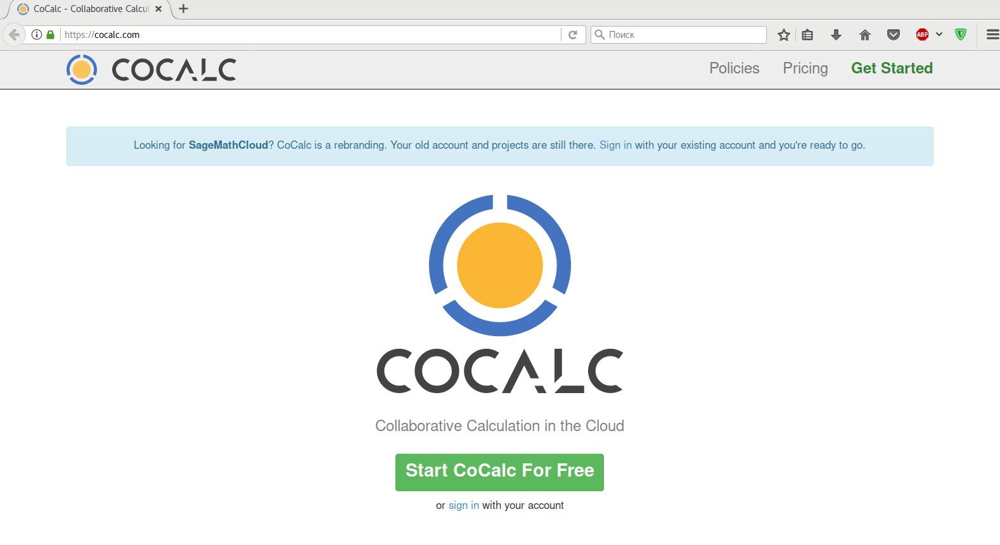

# Программирование на Python [:top:](https://github.com/pilyay/python-programming-course-by-bioinformatics-institute)

1. [

Операторы. Переменные. Типы данных. Условия
](#chapter_1)

	* :green_book: [Общая информация о курсе](#chapter_1.1)
	* :green_book: [Введение: программы и Python. Проверка заданий](#chapter_1.2)
	* :green_book: [Интерактивный режим Python. IPython](#chapter_1.3)
	* :green_book: [Установка Python на компьютер](#chapter_1.4)
	* :green_book: [Операции с целыми числами](#chapter_1.5)
	* :green_book: [Операции с вещественными числами](#chapter_1.6)
	* :green_book: [Типы данных](#chapter_1.7)
	* :green_book: [Переменные. Стандартный ввод/вывод](#chapter_1.8)
	* :green_book: [Логические операции, операции сравнения](#chapter_1.9)
	* :green_book: [Условия: if, else, elif. Блоки, отступы](#chapter_1.10)
	* :green_book: [Строки](#chapter_1.11)
	* :closed_book: [Задачи по материалам недели](#chapter_1.12)

2. [

Циклы. Строки. Списки
](#chapter_2)

	* :green_book: [Цикл while](#chapter_2.1)
	* :green_book: [Операторы break, continue](#chapter_2.2)
	* :green_book: [Цикл for](#chapter_2.3)
	* :green_book: [Строки и символы](#chapter_2.4)
	* :green_book: [Списки](#chapter_2.5)
	* :closed_book: [Задачи по материалам недели](#chapter_2.6)

3. [

Функции. Словари. Интерпретатор. Файлы. Модули
](#chapter_3)

	* :green_book: [Функции](#chapter_3.1)
	* :green_book: [Словари](#chapter_3.2)
	* :green_book: [Интерпретатор: установка, запуск скрипта](#chapter_3.3)
	* :green_book: [Файловый ввод/вывод](#chapter_3.4)
	* :green_book: [Модули, подключение модулей](#chapter_3.5)
	* :green_book: [Установка дополнительных модулей](#chapter_3.6)
	* :closed_book: [Задачи по материалам недели](#chapter_3.7)
	* :green_book: [Библиотеки для анализа данных. NumPy](#chapter_3.8)
	* :green_book: [Библиотека Matplotlib](#chapter_3.9)
	* :green_book: [Заключение](#chapter_3.10)

---

# Операторы. Переменные. Типы данных. Условия

## :green_book: Общая информация о курсе [:top:](#content)

### Добро пожаловать!

Мы рады видеть вас на курсе «Программирование на Python». В этом вводном уроке мы расскажем вам о том, что вас ждёт, и дадим рекомендации по прохождению курса. Жмите кнопку «вправо», чтобы перейти к следующему шагу.

### Сначала о формате

Каждая неделя состоит из нескольких уроков, которые представляют собой наборы коротких видео-лекций (от 30 секунд до 5 минут, в редких случаях дольше).

Обычно один урок посвящен обсуждению одного понятия в общем, а один видео-фрагмент внутри урока — одной стороне или детали понятия.

Видео чередуются с простыми тестами, состоящими из одного-двух вопросов для проверки только что услышанного материала.

Внутри одного урока видеофрагменты и тесты на платформе Stepik принято называть шагами (стэпами). В верхней части окна вы можете видеть несколько иконок-квадратов. Это кнопки навигации, позволяющие перемещаться от одного фрагмента видео или тестов к другому. Также можно использовать клавиши «вправо» и «влево» на клавиатуре.

**Перейдите к следующему шагу**, чтобы увидеть тестовое задание в действии.

### Задачи
Важной частью курса является закрепление изученного материала через решение задач. И именно по результатам решения задач вам будет поставлена оценка за курс. На шагах с задачами рядом с полем ответа приводится число баллов, которое вы получите за её решение, а также набранный вами балл.

Все задачи можно решать любое количество раз. За неверные попытки баллы не снижаются, не бойтесь ошибаться! Также, все ваши прошлые решения остаются доступны по ссылке под полем задачи.

Вопрос: как называется этот курс? Чтобы ответить, нажмите на зелёное поле ниже и выберите правильный ответ.

### Wakari и Trinket
В курсе используется онлайн-платформа Wakari, позволяющая работать в интерактивном режиме Python без его установки на локальный компьютер.

В случае высокой загрузки Wakari может стать недоступным. Вместо него можно использовать аналогичный сервис [Сocalc](https://cocalc.com). Так же можно использовать [Trinket.io](https://trinket.io/python/41462f0f16). Он позволяет запускать программы на Python в вашем браузере. У него есть некоторые отличия от Wakari, о которых будет упомянуто отдельно в уроке «Интерактивный режим Python».

### Общие рекомендации по онлайн-курсу
Чтобы все функции видео-плеера (например, ускорение видео) работали корректно, используйте одну из последних версий браузера. Подробнее о поддерживаемых версиях: <http://caniuse.com/#search=mp4>

Несмотря на то, что в курсе есть видео и текстовые материалы, ведите конспект или хотя бы делайте заметки. Так материал будет лучше запоминаться.

При необходимости ставьте видео на паузу. Помните, что в онлайн-курсе материал даётся в более сжатом виде, чем на обычных лекциях. И наоборот: ускоряйте видео, если изложение кажется вам слишком медленным.

Под каждым шагом есть форум для обсуждения. В нём можно (и нужно!) задавать вопросы по материалам и задачам курса, а также помогать другим, если знаете ответ. **Пожалуйста, не выкладывайте свой код и решения задач.** Старайтесь разобраться, в чем проблема, по наводящим вопросам. Формат курса не подразумевает поиск преподавателями ошибок в индивидуальных программах студентов..

При возникновении технических вопросов по курсу пишите на почту online@bioinformaticsinstitute.ru. 

### Критерии прохождения курса по Python
Рядом с каждым тестом и задачей указано количество баллов, которое вы получите за правильное решение. Ваш общий прогресс также отображается в оглавлении курса, там же видны и сроки сдачи каждой из задач.

Суммарная стоимость всех базовых задач составляет **94** балла. Дополнительные **6** баллов можно набрать за решение задач на программирование повышенной сложности.

Для получения сертификата по курсу необходимо набрать **80** баллов, для сертификата с отличием — **90** баллов. Как только наберёте 80 баллов, в течение суток автоматически получите сертификат, а потом баллы в нём будут сами обновляться по мере решения новых задач. 

Внимание, **дедлайнов по этому курсу нет**, то есть вы можете просматривать материалы и решать задачи в удобном для вас режиме. Но если вы действительно хотите пройти этот курс, советуем вам заниматься регулярно, и проходить хотя бы по несколько уроков в день.

### Форум
Напишите ниже пару слов о себе. Почему вы решили изучать этот курс?

### Удачного прохождения курса!
Ответы на основные вопросы по платформе вы можете найти в Help Center. 

Присоединяйтесь к нам в соцсетях, чтобы узнать последние новости о платформе и курсах:

[ВКонтакте](http://vk.com/rustepik), [Facebook](http://www.facebook.com/rustepik), [Google+](http://plus.google.com/u/0/b/106625599607783514169/106625599607783514169) и [Twitter](http://twitter.com/rustepik).

Рекомендуйте курс друзьям и знакомым, ведь вместе проходить его гораздо веселее!

## :green_book: Введение: программы и Python. Проверка заданий [:top:](#content)

### Step 1 (S-12300)
Step on Stepik: <https://stepik.org/lesson/3360/step/1>

Приветствуем вас на первой неделе курса!

Мы начнем знакомство с языком Python с обзора самых базовых его возможностей, которые в то же время являются фундаментальными для разработки алгоритмов на большинстве широко используемых языков программирования: арифметические и логические операции, работа с переменными, условия, порядок выполнения.

Большое внимание будет уделено приложению IPython Notebook, с помощью которого можно работать с Python в интерактивном режиме, используя интуитивный веб-интерфейс. Благодаря этому приложению мы сразу увидим, как Python может быть использован для решения различных задач.

Часть заданий этой недели, как и большинство заданий всего курса, будет представлять из себя задачи на написание программ. Они проверяются автоматически на большом количестве случайно сгенерированных данных, поэтому мы не сможем, например, дать разъяснений, на каком именно датасете программа сработала неверно.

Для выполнения таких задач необязательно иметь установленный Python на своем компьютере, так как программы проверяются на сервере Stepic, однако это крайне желательно для дальнейшей работы.

Весь код на Python, рассматриваемый в рамках этой недели, опубликован по этой ссылке
<https://wakari.io/sharing/bundle/Pavel/week_1>
Также доступно для просмотра и скачивания объединенное видео лекций всей недели:
<http://player.vimeo.com/video/112051973>

Желаем удачи!

### Step 2 (S-12217)
Step on Stepik: <https://stepik.org/lesson/3360/step/2>

_1.png)

Здравствуйте. Меня зовут Павел Федотов. Я рад приветствовать вас на вводном курсе программирование на языке Python. В наше время вычисления и программирование проникли практически во все области человеческой деятельности и перестали быть уделом исключительно только суровых программистов.

Сегодня умение программировать будет полезно практически каждому. Данный курс основан на опыте обучения биологов программированию. Пройдя данный курс, вы научитесь с помощью языка Python осуществлять вычисления, необходимые вам, делать ввод вывод данных в ваших программах, писать программы, которые содержат условные конструкции и циклы, разрабатывать свои функции и использовать встроенные в Python функции и структуры данных.

Для того чтобы учиться программировать, вам необходимо будет писать программы. Просмотра одних только видеолекций будет недостаточно, также как недостаточно просмотра балета для того, чтобы научиться танцевать. Важна практика, поэтому мы предложим вам большое количество заданий. Некоторые задания будут на понимание, но большая часть заданий будет на написание программы.

Программы вы, естественно, будете писать на языке Python. Python, по-русски так же часто называют питоном, на самом деле назван в честь британской комик-группы Монти Пайтон. Язык был впервые анонсирован в 1991 году голландским программистом Гвидо ван Россумом и с тех пор развивается силами широкого сообщества программистов. Было выпущено большое количество версий этого языка. В 2008 году вышла версия Python 3, в которую был внесен ряд изменений, которые сделали этот язык несовместимым с предыдущими версиями.

Это означает, что программы, написанные на более ранних версиях языка оказалось невозможно запускать на новой версии языка - Python 3. И с тех пор существуют параллельно 2 ветки языка: Python 2 и Python 3.

Мы с вами в этом курсе будем использовать самую последнюю версию - 3 версию языка.

### Step 3 (S-12218)
Step on Stepik: <https://stepik.org/lesson/3360/step/3>

Что же это за зверь такой питон или Python? С одной стороны, Python - это интерпретатор, то есть специальная программа, которая интерпретирует или выполняет по шагам другие программы. Скачать этот интерпретатор вы можете на сайте python.org.

С другой стороны, Python, будучи языком программирования, определяет набор правил, согласно которым составляются программы. И также определяет набор правил, согласно которым эти программы исполняются на компьютере. Таким образом, программы, в том числе и те, что вы будете писать на этом курсе, представляют из себя последовательность команд для компьютера, которые написаны согласно правилам языка Python.

Более или менее все программы выглядят следующим образом. Программа читает некие пользовательские данные (чтение может происходить с клавиатуры, из файла на компьютере, или данные могут браться из интернета), дальше программа как-то манипулирует этими данными, обрабатывает их, вычисляет какие-то значения и в конце программа выводит результат пользователю. Результат может выводиться на экран, может выводится в файл или посылаться по сети. Таким образом, во многих задачах, которые будут вам предложены, вам надо будет написать программу, которая будет читать данные с клавиатуры и выводить результат на экран. Также будет несколько задач, в которых надо будет читать данные из файла и выводить результаты в файл и дальше загружать этот файл на сайт. Но все же в большинстве задач вам нужно будет загрузить на сайт именно исходный текст программы. Загруженный вами текст на языке Python запущен у нас на нашем сервере и проверен на наборе тестов. Этот набор тестов будет вам неизвестен и программа будет засчитываться как правильная, если для всех тестов будет получен правильный результат. То есть на всех возможных входных данных будут получены правильные выходные данные.

Но это все будет чуть дальше. Давайте для начала поймем, где в принципе писать программу. И тут у вас есть множество вариантов. Поскольку текст программы - это в первую очередь именно текст, то писать программу можно в любом текстовом редакторе. Например, в блокноте или любом другом редакторе, который вам больше нравится. Но гораздо приятней писать программы в такой среде, где у вас будет подсветка синтаксиса (выделение ключевых конструкции языка). Если в этой среде можно выполнять программу и сразу же и видеть результат ее работы. Или есть возможность выполнять эту программу по шагам, то есть в интерактивном режиме сразу видеть, какой результат выдает каждая команда. В принципе есть среды, которые позволяют все это делать. Одна из таких сред - это pycharm, разработанная JetBrains. (Ссылка на скачивание в следующем Step)

### Step 4 (S-13282)
Step on Stepik: <https://stepik.org/lesson/3360/step/4>

**Полезные ссылки**

Официальный сайт Python, где можно скачать интерпретатор (Python 3): <https://www.python.org/>

Официальная документация по Python: <https://docs.python.org/3/>

Веб-сервис, позволяющий исполнять программы на Python прямо в вашем браузере: <https://trinket.io/python/41462f0f16>
Среда для написания программ PyCharm Educational Edition или PyCharm Community Edition:
<https://www.jetbrains.com/pycharm-educational/>
<https://www.jetbrains.com/pycharm/>

Текстовый редактор с подсветкой синтаксиса программ Sublime Text 3: <http://www.sublimetext.com/3>

Интерактивный учебник языка Python (на русском языке): <http://pythontutor.ru/>

Книга A Byte of Python: <http://www.swaroopch.com/notes/python/>
и ее перевод на русский: <http://wombat.org.ua/AByteOfPython/>

## :green_book: Интерактивный режим Python. IPython [:top:](#content)

### Step 1 (S-14147)
Step on Stepik: <https://stepik.org/lesson/3361/step/1>

В этом уроке мы обсудим онлайн-сервис Wakari, позволяющий работать с интерпретатором IPython без установки на компьютер пользователя.

В случае высокой загрузки Wakari может стать недоступным. Вместо него можно использовать аналогичный сервис [Сocalc](https://cocalc.com/). Так же можно использовать [Trinket.io](https://trinket.io/python/41462f0f16). Он позволяет запускать программы на Python в вашем браузере. В отличие от Wakari, в Trinket используется не IPython, а просто Python. Поэтому для того, чтобы увидеть значение выражения, необходимо явно вызвать функцию print(), иначе оно не будет отображаться. Например, вместо `42 + 8 * 3` нужно написать `print(42 + 8 * 3)` и нажать кнопку "Run".

### Step 2 (S-132128)
Step on Stepik: <https://stepik.org/lesson/3361/step/2>

К сожалению, онлайн-сервис Wakari перестал предоставлять возможность работать с IPython Notebook. Для установки его на свой компьютер обратитесь к [следующему по счёту уроку](https://stepik.org/lesson/7150/)

### Step 3 (S-12221)
Step on Stepik: https://stepik.org/lesson/3361/step/3

Писать и запускать программы на **Python** можно не устанавливая себе на компьютер никаких допольнительного программного обеспечения. Для этого можно использовать сервис [Сocalc](https://cocalc.com/).

Для начала работы необходимо пройти регистрацию.

S-12221-2.png

По окончании процесса регистрации вы бедет перенаправлены на страницу создания первого проекта. В поле ввода указываем имя нашего проекта и кликаем по кнопке - **Create project**.

S-12221-3.png

Выберем в меню - **+New**

S-12221-4.png

И создадим новый ноутбук. Нужно указать его имя и тип (**Jupyter notebook**).

S-12221-5.png

По умолчанию ноутбук работает в окружении **Python2**.

S-12221-6.png

Исправим это.

S-12221-7.png

Поздравляем! Вы можете теперь писать и запускать программы на **Python3**.

S-12221-8.png

В качестве примера посчитаем сумму двух чисел. Введем внутри ячейки **2 + 2**. Для того, чтобы запустить код на выполнение нужно нажать кнопку запуска или нажать **<Ctrl> + <Enter>**.

S-12221-9.png

В строке **Out** программа выведет результат.

S-12221-10.png

### Step 4 (S-12222)
Step on Stepik: <https://stepik.org/lesson/3361/step/4>

Мы можем указывать в одной ячейке несколько команд. Для примера напечатаем "Hello!" и посчитаем сумму: 2 + 2.

S-12222-1.png

Видим в выводе результат выполнения обоих команд.

### Step 5 (S-12223)
Step on Stepik: <https://stepik.org/lesson/3361/step/5>

Мы можем изменить имя нашего ноутбука на более осмысленное. Выберем пункт **Rename** в меню **File**.

S-12223-12.png

Введем новое имя нашего ноутбука. Например: **my_first_program.ipynb**.

S-12223-11.png

Нажмем кнопку **Rename item** и убедимся, что название ноутбука изменилось.

S-12223-10.png

В случаях, когда нужно сохранить файл программы у себя на компьютере, поделиться с другими или опубликовать в интернете, можно воспользоваться пунктом **Download as** в меню **File** и выбрать необходимый формат файла.

S-12223-3.png

В появившемся окне будут доступны: ссылка на файл и кнопка для скачивания файла на компьютер.

S-12223-2.png

Для примера, выберем сохранение файла.

S-12223-1.png

### Step 6 (S-12224)
Step on Stepik: <https://stepik.org/lesson/3361/step/6>

**Ipython notebook** позволяет совмещать текст программы с любым другим текстом. Например, мы можем взять ячейку, вставить перед ней еще одну, просто кликнув мышкой на **"Insert"** в панели меню.

S-12224-1.png

Далее изменим режим новой ячейки на **"Markdown"**.

S-12224-2.png

Мы можем написать в ячейке произвольный текст.

S-12224-3.png

Теперь, когда мы нажмем "**Shift + Enter**", эта строчка не будет исполняться и как-нибудь интерпретироваться, а превратиться для интерпретатора **Python** просто в текст.

S-12224-4.png

В итоге наша программа на Python может складываться из нескольких ячеек. На предыдущем шаге мы узнали, как сохранить файл программы на компьютер. Сохраним нашу программу как файл с расширением **.py** и откроем ее текстовом редакторе.

S-12224-5.png

Видим, что все вспомогательные строчки закомментированы. Незакомментированными остались только инструкции для интерпретатора. Далее, если ваша программа уже готова, вы можете отправить на ее проверку. Для этого просто выделите весь текст, скопируйте его и вставьте на сайте в окно ответа.

## :green_book: Установка Python на компьютер [:top:](#content)

### Step 1 (S-14829)
Step on Stepik: https://stepik.org/lesson/7150/step/1

В этом курсе для написания и запуска программ на питоне мы используем IPython Notebook. Давайте разберемся с тем, как установить IPython Notebook на компьютер.

**Установка IPython Notebook в Windows.**

Для того, чтобы установить IPython Notebook необходимо зайти на [сайт](https://www.continuum.io/downloads) и перейти по ссылке на страницу загрузки Miniconda.

S-14829-1.png

Выберите Python3.6 и в зависимости от вашей системы 64-х или 32-х битную версию.

S-14829-2.png

Пройдите по ссылке и скачайте установочный файл на ваш компьютер.

S-14829-3.png

По окончании загрузки, откройте папку с загруженным файлом. Найдите в списке файл установщика Miniconda и запустите его.

S-14829-4.png

В появившемся окне установщика, нажмите кнопку "Next".

S-14829-5.png

Вам предложат ознакомится с лицензией и согласиться с ней. Нажмите "I Agree".

S-14829-6.png

В следующем окне необходимо выбрать, будет ли доступна программа для всех пользователей. Выберите необходимый вариант и нажмите кнопку "Next".

S-14829-7.png

Установщик предложит путь, по которому будут установлены файлы программы. Измените его, если устанавливаете программы по другому пути.

S-14829-8.png

Поставьте галочку напротив пункта: Add Anaconda to the system PATH environment variable и нажмите кнопку "Install".

S-14829-9.png

S-14829-10.png

Дождитесь завершения установки файлов и нажмите кнопку "Next".

S-14829-11.png

Оставьте галочки, если хотите узнать об Anaconda больше и завершите установку, нажав "Finish".

S-14829-12.png

Теперь, когда Python установлен, необходимо установить IPython Notebook. Для этого мы будем использовать стандартный установщик питоновских пакетов - **pip**. Нажмите кнопку "Пуск" и в открывшемся меню, в строке поиска наберите следующую команду: **pip install jupyter notebook**

S-14829-23.png

Запустится консоль. Вы можете наблюдать сообщения pip о загрузке и установке пакета и его зависимостей.

S-14829-28.png

S-14829-29.png

После завершения установки, консоль автоматически закроется.

Для того, чтобы запустить IPython Notebook, необходимо в строке поиска меню "Пуск" набрать команду и нажать "Enter":

S-14829-30.png

В открывшейся консоли появится сообщение о запуске IPython Notebook

S-14829-25.png

В браузере откроется страница:

S-14829-18.png

Создадим новый notebook (New -> Python3)

S-14829-19.png

Notebook готов к работе!!!

**Установка IPython Notebook в Mac OS X.**

На странице загрузки Miniconda выбираем версию установщика и скачиваем его.

S-14829-31.png

По окончании загрузки откроем терминал.

S-14829-32.png

Перейдем в директорию с файлом установщика и запустим его (прим. на слайде приведена команда на момент написания курса, после команды bash укажите имя скаченного вами файла установщика).

S-14829-33.png

Запустится процесс установки, вам будет предложено ознакомится и согласится с лицензией программы.

S-14829-34.png

Далее будет задано несколько вопросов, касающихся настроек. Хорошим выбором будет - оставить настройки по умолчанию.

Когда установка завершится, приступим к установке необходимых пакетов. Для этого в консоли необходимо набрать команды со слайда ниже.

S-14829-35.png

Запуск IPython Notebook

S-14829-36.png

Запустится локальный сервер и в окне браузера откроется IPython Notebook.

S-14829-37.png

Создадим новый notebook.

S-14829-38.png

### Step 2 (S-14844)
Step on Stepik: <https://stepik.org/lesson/7150/step/2>

Cсылка для скачивания пакета Miniconda: <http://conda.pydata.org/miniconda.html>

Установка IPython (для Windows): <https://stepic.org/media/attachments/course67/ipython_install.cmd>

Установка IPython (для OS X и Linux): <https://stepic.org/media/attachments/course67/ipython_install.sh>

Команды для запуска: `conda update conda --yes conda install ipython --yes conda install ipython-notebook --yes conda install pyzmq --yes conda install jinja2 --yes conda install tornado --yes`

## :green_book: Операции с целыми числами [:top:](#content)

### Step 1 (S-14010)
Step on Stepik: <https://stepik.org/lesson/2228/step/1>

В этом уроке мы начнем пользоваться IPython Notebook с помощью сервиса Wakari.

Для вашего удобства получившийся при демонстрации notebook мы выложили в открытый доступ по следующей ссылке: ,https://wakari.io/sharing/bundle/Pavel/int_operations>

Для лучшей читаемости текста в видео, рекомендуем поставить максимальное качество видео (число в правой нижней части видео-плеера) и развернуть плеер на полный экран (кнопка в правой верхней части плеера).

### Step 2 (S-12050)
Step on Stepik: https://stepik.org/lesson/2228/step/2

Мы можем использовать Python для арифметических вычислений. Сначала посмотрим на основные операции с целыми числами. Для этого запустим IPython notebook, убедимся что работаем в окружении Python3 и посчитаем сумму двух чисел, например 2 и 5. Набираем арифметическое выражение, нажимаем **<Shift> + <Enter>** и видим результат - 7. Можно посчитать разность двух чисел или их произведение.

S-12050-1.png

В принципе можно посчитать произведение двух очень больших чисел.

S-12050-2.png

Python без проблем посчитает их. Можно использовать более сложные выражения, состоящие из нескольких операций. Для примера посчитаем выражение **3 + 5 * 4**

S-12050-3.png

Получим результат - 23. Вычисления выполняются по правилам арифметики - сначала выполняется умножение **5 * 4** (умножение более приоритетная операция) и к результату прибавляется 3.

Мы можем использовать в наших выражениях скобки. Например, можно изменить порядок выполнения нашего предыдущего выражения.

S-12050-4.png

Результат будет: 32, как и следовало ожидать.

## :green_book: Операции с вещественными числами [:top:](#content)

## :green_book: Типы данных [:top:](#content)

## :green_book: Переменные. Стандартный ввод/вывод [:top:](#content)

## :green_book: Логические операции, операции сравнения [:top:](#content)

## :green_book: Условия: if, else, elif. Блоки, отступы [:top:](#content)

## :green_book: Строки [:top:](#content)

## :closed_book: Задачи по материалам недели [:top:](#content)

# Циклы. Строки. Списки

## :green_book: Цикл while  [:top:](#content)

## :green_book: Операторы break, continue [:top:](#content)

## :green_book: Цикл for [:top:](#content)

## :green_book: Строки и символы [:top:](#content)

## :green_book: Списки [:top:](#content)

## :closed_book: Задачи по материалам недели [:top:](#content)

# Функции. Словари. Интерпретатор. Файлы. Модули

## :green_book: Функции  [:top:](#content)

## :green_book: Словари [:top:](#content)

## :green_book: Интерпретатор: установка, запуск скрипта [:top:](#content)

## :green_book: Файловый ввод/вывод [:top:](#content)

## :green_book: Модули, подключение модулей [:top:](#content)

## :green_book: Установка дополнительных модулей [:top:](#content)

## :closed_book: Задачи по материалам недели [:top:](#content)

## :green_book: Библиотеки для анализа данных. NumPy [:top:](#content)

## :green_book: Библиотека Matplotlib [:top:](#content)

## :green_book: Заключение [:top:](#content)
